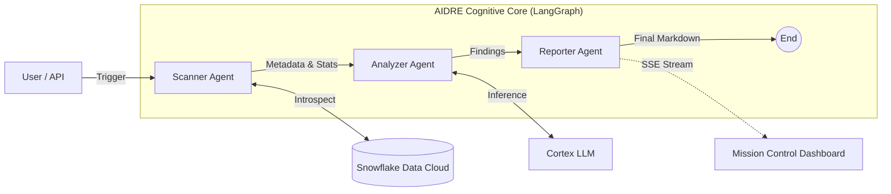

# AIDRE: AI Data Reliability Engineer

    

**AIDRE** is an autonomous Multi-Agent System (MAS) designed to automate the role of a Data Reliability Engineer. Unlike traditional deterministic data quality tools (e.g., Great Expectations, dbt tests), AIDRE uses a graph-based cognitive architecture to **observe, reason, and report** on data health in real-time.

It leverages **LangGraph** for stateful agent orchestration and **Snowflake Cortex** for secure, serverless LLM inference directly where the data lives.

## 🏗️ Architecture

AIDRE operates as a Directed Cyclic Graph (DAG) of specialized agents. The system is event-driven and maintains a persistent state throughout the reliability check lifecycle.



## 🤖 The Agents

### 1. Scanner Agent (The Observer)
*   **Role**: Responsible for "Situation Awareness".
*   **Function**: Introspects the Snowflake Information Schema to gather technical metadata (column types, constraints) and calculates statistical profiles (row counts, null rates, freshness).
*   **Implementation**: Pure Python, optimized for high-concurrency SQL execution.

### 2. Analyzer Agent (The Brain)
*   **Role**: Responsible for "Reasoning & Detection".
*   **Function**: Ingests the raw signals from the Scanner and uses a **Cortex LLM** to perform semantic analysis. It detects anomalies that are hard to capture with static rules, such as "distribution drift" or "schema incongruence".
*   **Key Feature**: Uses deterministic sampling (Temperature 0.0) to ensure reproducible analysis.

### 3. Reporter Agent (The Communicator)
*   **Role**: Responsible for "Synthesis".
*   **Function**: Aggregates all findings into a structured, executive-level Reliability Report. It prioritizes critical issues and generates actionable remediation steps.

## 🛠️ Tech Stack

*   **Orchestration**: [LangGraph](https://langchain-ai.github.io/langgraph/) - Enables cyclic, stateful multi-agent workflows.
*   **API Layer**: [FastAPI](https://fastapi.tiangolo.com/) - Exposes the agent graph via Server-Sent Events (SSE) for real-time observability.
*   **Data & AI**: [Snowflake](https://www.snowflake.com/) - Acts as both the data warehouse and the inference engine (via Cortex).
*   **Validation**: [Pydantic](https://docs.pydantic.dev/) - Enforces strict schema validation for all agent communication.

## 🚀 Getting Started

### Prerequisites
*   Python 3.11+
*   Node.js 18+ (for dashboard)
*   Snowflake Account with Cortex enabled

### Backend Setup

1.  **Clone & Install**
    ```bash
    git clone https://github.com/yourusername/aidre.git
    cd aidre/backend
    pip install -r requirements.txt
    ```

2.  **Environment Configuration**
    Create a `.env` file in `backend/`:
    ```ini
    SNOWFLAKE_ACCOUNT=...
    SNOWFLAKE_USER=...
    SNOWFLAKE_PASSWORD=...
    SNOWFLAKE_ROLE=...
    SNOWFLAKE_WAREHOUSE=...
    SNOWFLAKE_DATABASE=...
    SNOWFLAKE_SCHEMA=BUSINESS_DATA
    ```

3.  **Run the Agent Server**
    ```bash
    uvicorn src.api.main:app --reload --port 8000
    ```

### Frontend Dashboard via Next.js 

Access the Mission Control Dashboard at `http://localhost:3000`.

## 📜 License

MIT
